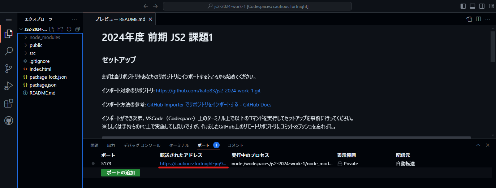

# 2024年度 前期 JS2 課題2

## セットアップ

まずは当リポジトリをあなたのリポジトリにインポートするところから始めてください。

インポート対象のリポジトリ: https://github.com/kato83/js2-2024-work-2.git

インポート方法の参考: [GitHub Importer でリポジトリをインポートする - GitHub Docs](https://docs.github.com/ja/migrations/importing-source-code/using-github-importer/importing-a-repository-with-github-importer)

インポートができ次第、VSCode（Codespace）上のターミナル上で以下のコマンドを実行してセットアップを事前に行ってください。  
※もしくは手持ちのPC上で実施しても良いですが、作成したGitHub上のリモートリポジトリにコミット&プッシュを忘れずに。

```sh
$ npm install
$ npm run dev
```

`npm run dev` 実行時にターミナル上で表示されるリンクを `Ctrl + クリック` もしくは画面下部のパネルの `ポート` タブ内の `転送されたアドレス` を開いてサーバーが正常に起動して開発ができる状態になっているか確認をしてください。



## 提出期限 01/27 09:00:00まで

年内最後の授業の日の内に授業内で提出状況を確認します。  

## 提出方法

共有したスプレッドシートに作成したGitリポジトリのURLを記入してください。

例 `https://github.com/kato83/js2-2024-work-2`  
※ `https://github.com/ユーザー名/インポートした際のリポジトリ名` の規則になります。

## 課題内容

**自由**

- 前提条件
  - GitHub のリモートリポジトリ上に開発資材がプッシュされていること
  - 事前に用意してある **Vite** を用いて開発がされていること（Viteの削除はNG）
  - ブラウザ上で動作しているのが確認できること
- 加点対象
  - JS2で学んだ内容を取り入れているのが確認できたらプラス評価します
  - JS1及びJS2で学んでいない内容を取り入れているのが確認できたらよりプラス評価します
  - アイデア面でもプラス評価します
- 減点対象
  - `npm run dev` が実行できず、壊れた状態となっている場合
  - `npm run dev` が実行できてもブラウザ上で（全部・一部）動作しない場合
  - 実装にコメントが一切ない場合（全行書く必要はないです）
  - インデントが守られていること

